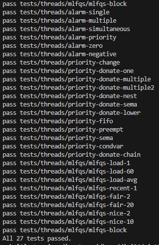

# KAIST PintOS Project

## Priority / BSD 4.4 Scheduler
[프로젝트1 Readme](./READMEs/README_PriorityBSD.md)

### 결과

## User Program
[프로젝트2 Readme](./READMEs/README_UserProgram.md)

### 결과

## Virtual Memory
[프로젝트3 Readme](./READMEs/README_VirtualMemory.md)

### 결과

