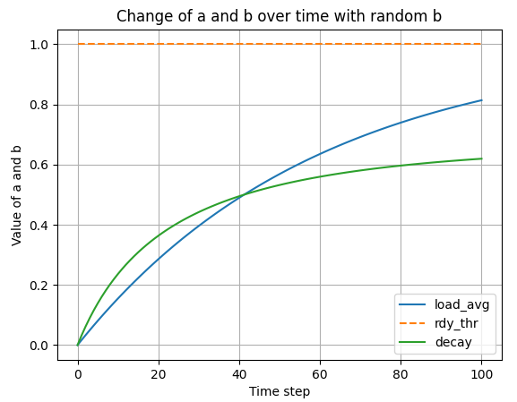
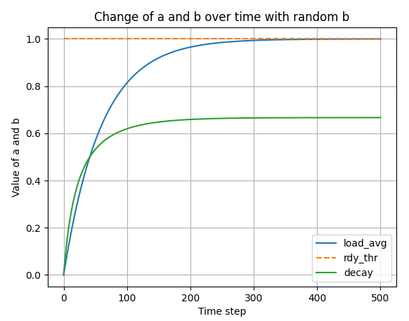
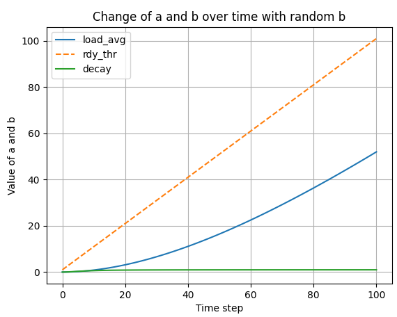
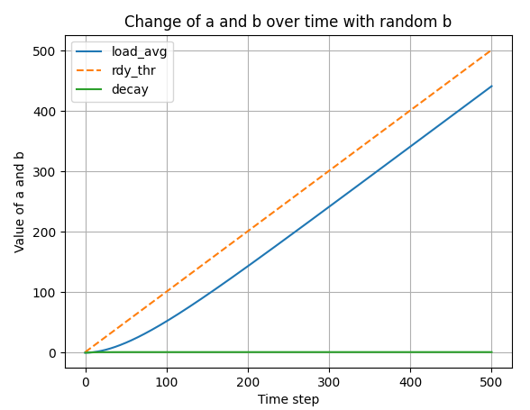
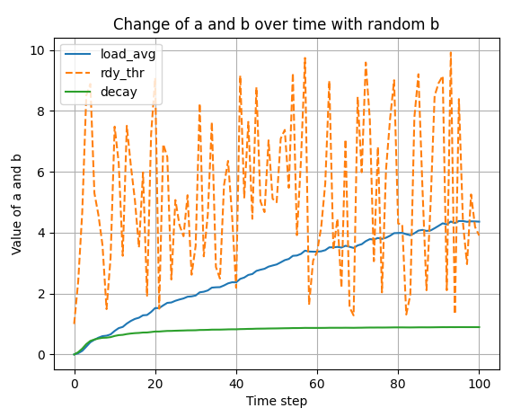
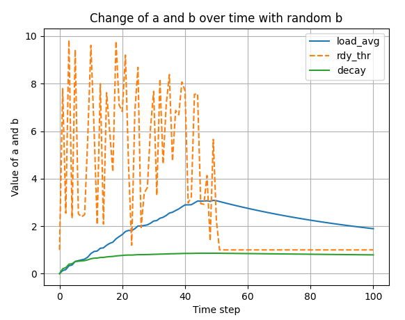
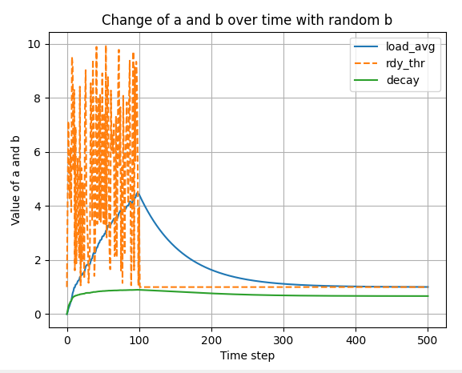

# 4.4 BSD 스케줄러

## 개요

4.4 BSD (Berkeley Software Distribution) 운영체제는 유닉스 계열의 운영체제로, 스케줄링 알고리즘에 많은 주목을 받아왔다. 4.4 BSD 스케줄러는 효율적인 CPU 시간 배분을 위해 설계된 MLFQ방식을 사용한다. 이 스케줄러의 주요 목표는 시스템의 응답성을 높이면서 효율적으로 자원을 관리하는 것이다.

### 스케줄링의 원리

4.4 BSD 스케줄러는 프로세스를 여러 개의 우선순위 큐에 나누어 관리한다. 각 큐는 다른 우선순위 레벨을 가지며, 높은 우선순위의 큐가 낮은 우선순위의 큐보다 먼저 CPU 시간을 할당받는다. (우선순위 스케줄링?)

1. **시간 할당량 사용** 
    
    프로세스가 할당 받은 시간을 모두 사용하면 낮은 우선순위의 큐로 이동한다.
    
2. **입출력 요청**
    
    대기 상태인 프로세스가 입출력을 요청하면, 더 높은 우선순위의 큐로 승격될 수 있다. 이는 입출력을 많이 요구하는 프로세스가 CPU를 적게 사용할 때 빠르게 응답을 받을 수 있도록 한다.
    

## 스케줄링 구현

> **해야 할 일**
> 

우선순위 스케줄러와 유사하게, advanced scheduler는 우선순위를 기준으로 스레드를 선택한다. 하지만, 고급 스케줄러는 우선순위 기부를 하지 않는다. 그러므로, 고급 스케줄러 작업을 진행하기 전, 우선순위 기부를 하지 않는 선에서의 우선순위 스케줄러를 기준으로 작업하기를 추천한다. 

pintOS startup time에서 동작하는 스케줄링 알고리즘을 사용한다. 디폴트로 우선순위 스케줄러는 동작해야 하며, 4.4BSD 스케줄러를 -mlfqs 커널 옵션을 통하여 선택할 수 있게 하여야 한다. `thread_mlfqs` 옵션을 `true` 로 전달하게 되면(이는 `threads/thread.h` 에 선언되어 있다), `main()`에 있는 `parse_options()` 에 의하여 걸려져서 전달된다.

일반 목적 스케줄러의 목표는 스레드의 다른 스케줄링 요구를 균형 맞추는 것이다. 많은 입출력을 수행하는 스레드는 입력 및 출력 장치를 계속 사용할 수 있도록 빠른 반응 시간이 필요하지만 CPU 시간은 거의 필요치 않다. 반면에, 계산 위주의 스레드는 작업을 마치기 위해 많은 CPU 시간을 필요로 하나, 빠른 반응 시간은 필요하지 않다. 다른 스레드들은 입출력과 계산이 번갈아가며 이루어지므로 시간에 따라 요구사항이 변화한다. 잘 설계된 스케줄러는 이러한 모든 요구사항을 동시에 수용할 수 있다.

스케줄러의 여러 요소는 일정 수의 타이머 틱이 지난 후 데이터를 업데이트 해야 한다. 모든 경우에 있어서, 이러한 업데이트는 커널 스레드가 실행될 기회가 있기 전에 이루어져야 한다. 그래서 커널 스레드가 새로 증가된 timer_ticks() 값을 보았지만 스케줄러 데이터 값은 이전 상태인 경우가 발생하지 않도록 해야 한다.

### Niceness

스레드의 우선순위는 동적으로 아래에 공식에 의해 결정된다. 하지만, 각 스레드는 다른 스레드에비해 nice 정도를 정수값의 nice value로 가지고 있다. 양수의 nice는 최대 20까지만 가지며 한 스레드의 우선순위를 낮추고, CPU 시간을 다른 스레드에게 양보한다. 반면에, 음수의 nice는 -20까지 가질 수 있으며 다른 스레드의 CPU 시간을 뺏는다.

초기 스레드의 nice 값은 0으로 시작한다. 다른 스레드는 그들의 부모 스레드로부터 nice 값을 받는다. 아래에 있는 테스트에 사용될 함수들을 구현해야 한다. 

```c
int thread_get_nice(void);
int thread_set_nice(int nice);
// 현재 스레드의 nice 값을 설정하며, 
// 그 스레드의 우선순위를 계산하여 더 이상 최우선순위를
// 가지지 않으면 yield 한다.
```

### Calculating Priority

우리의 스케줄러는 0 ~ 63까지의 우선순위를 갖는다. 숫자가 높을 수록 우선순위가 높다. 스레드의 우선순위는 스레드 초기화 당시에 설정해주며, 매 **타임 슬라이스**마다 다시 계산된다.

> priority = PRI_MAX - (recent_cpu / 4) - (nice * 2)
> 

recent_cpu는 최근 스레드가 사용한 CPU 시간의 추정 값이다. 결과는 정수값으로 반내림 연산을 해야한다. **recent_cpu와 nice에 대한 1/4 , 2 계수는 깊은 의미는 없으며**, 계산된 우선순위는 항상 PRI_MIN부터 PRI_MAX 사이의 유효한 범위에 맞게 조정된다.

이 공식은 최근에 CPU 시간을 받은 스레드에게 다음 스케줄러 실행 시 CPU를 다시 할당할 때 더 낮은 우선순위를 부여한다. 이것은 starvation을 방지하는데 중요하며, 최근데 CPU 시간을 전혀 받지 못한 스레드는 recent_cpu 값이 0이 되므로, 높은 nuce값을 가진 스레드를 제외하곤 곧 CPU 시간을 받게될 것이다. 

### Caculating `recent_cpu`

우리는 recent cpu가 각 프로세스가 **최근에** 받은 CPU 시간을 측정하길 바란다. 더욱이 개선 사항으로 recent CPU 시간은 최근 CPU 시간보다 더 높은 가중치를 부여해야 한다. 한가지 접근 방법은 맞지막 n초 동안 각각의 CPU 시간을 추적하기 위해 n개의 요소 배열을 사용하는 것이다. 그러나 이 방법은 매 새로운 스레드마다 O(n)의 공간과 새로운 가중 평균을 계산하는데 O(n) 시간이 필요하다.

대신, 지수 가중 이동 평균을 사용하여 다음과 같이 일반적인 형태를 갖는다.

> x(0) = f(0),
x(t) = ax(t - 1) + (1 - a) f(t),
a = k / (k + 1),
> 

x(t)는 `t ≥ 0` 의 정수 시간 t에 대한 이동 평균을 나타내도, f(t)는 평균화되는 함수이며, k (k > 0)는 감쇠 속도를 제어 한다.

다음과 같이 몇 단계 동안 이 공식을 반복할 수 있다. 

$$
x(0) = 0
$$

$$
x(t)=ax(t-1) + (1-a)f(t)
$$

$$
...
$$

$$
a_{\text{decay}} = \frac{k}{k+1}
$$

이러한 단계를 반복함으로써 우리는 지수 가중 이동 평균을 계산할 수 있다. `t >= 0` , f(t) 는 평균을 구하는 함수이며, k > 0 이 decay의 비율을 결정한다. $f(t)$의 값은 1의 가중치를 갖는 t와 가중치 a에 의해 결정된다. 

 예를 들어, k=2로 설정하면, 가중치 감쇠는 상대적으로 빠르게 이루어 진다.

첫 번째 스레드에서 recent_cpu의 초기 값은 0이며, 다른 새 스레드에서는 부모의 값을 가진다. 타이머 인터럽트가 발생할 때마다, **idle 스레드가 실행 중이 아닌 경우 실행 중인 스레드에 대하여 recent_cpu가 1씩 증가한다.** 또한, 1초에 한 번씩 모든 스레드(Running, Ready, Block등 모두)에 대해 recent_cpu값을 갱신해야 한다.

```c
decay = (2 * load_avg) / (2 * load_avg + 1);
recent_cpu = decay * recent_cpu + nice;
```

여기서 load_avg는 **실행 준비 중인 스레드 수의 이동 평균**이다. load_avg가 1이라면, 이는 평균적으로 하나의 스레드가 CPU를 경쟁하고 있음을 나타내며, 현재의 recent_cpu 값은 약 6초 후에 .1 의 가중치로 감소한다. 하위 `load_average() 시간 변화에 따른 변화 분석` 에서 그래프로 추가 설명한다.

일부 테스트에서 가정하는 것은 recent_cpu 를 재계산하는 것이 시스템 틱 카운터가 1초의 배수가 되는 순간(**TIMER_FREQ의 배수**)일 때만 이루어지고 다른 때에는 이루어지지 않는다. nice 값이 음수인 스레드의 경우 recent_cpu 값이 음수가 될 수 있다. 또한, 공식을 구현할 때 계산 순서를 고려해야 하며, recnet_cpu의 계수를 먼저 계산한 후 곱하는 것을 추천한다. (일부는 load_avg를 recent_cpu에 직접 곱하면 오버플로우가 발생할 수 있다고 한다.)

### **Calculating `load_avg`**

마지막으로 load_avg는 시스템 부하 평균으로, 지난 1분간의 실행 준비된 스레드들의 수를 측정한다. recent_cpu와 같이, 이는 기하급수적으로 가중치를 둔 이동 평균이다. priority와 recent_cpu와는 달리, load_avg는 시스템 전체에 적용되며, 특정 스레드에 국한되지 않는다. 시스템 부팅 시, load_avg는 0으로 초기화 되며 이후 1초마다 다음 공식에 따라 갱신된다. 

```c
load_avg = (59/60) * load_avg + (1/60) * ready_threads
```

ready_threads는 업데이트 시점에서 실행 중이거나 실행 준비가 된 스레드의 수를 의미하며, idle 스레드는 포함되지 않는다. 일부 테스트에서 load_avg가 시스템 틱 카운터가 1초의 배수에 도달했을 때 정확히 업데이트 되어야 한다는 것을 가정한다.

즉, `timer_ticks() % TIMER_FREQ == 0` 일 때만 이루어지고, 다른 때는 이루어지지 않는다.

## 요약

> **In every 4 tick, recompute the priority of all threads.**
> 

```c
priority = PRI_MAX - (recent_cpu / 4) - (nice * 2)
```

> **CPU usage**
> 

```c
recent_cpu = decay * recent_cpu + nice
```

- Increase the recent_cpu of the currently running process by 1 in every timer interrupt
- Decay `recent_cpu` by `decay` factor in every second.
    
    > recent_cpu = decay * recent_cpu
    > 
- Adjust `recent_cpu` by `nice` in every second.
    
    > recent_cpu = recent_cpu + nice
    > 
- Putting them together

> **Decay factor**
> 

```c
decay = (2 * load_average) / (2 * load_average + 1)
```

> **load_average()**
> 

```c
load_avg = (59/60) * load_avg + (1/60) * ready_threads
```

means → how busy the system is.

- ready_threads
    - number of threads in the ready list + threads in the esxecuting at the time of an update.

### 그래프 분석

---

- load_average() 시간 변화에 따른 변화 분석 (if b = 1)
    
    
    ```c
    load_avg = 59/60 * load_avg + 1/60 * number_of_(ready_threads)
    ```
    
     시간에 대한 고려 없이 위를 단순한 수식으로 본다면, 우변의 59/60*load_avg를 좌변으로 넒겨보면  “1/60 * load_avg = 1/60 * ready_threads” 가 되면서 load_avg는 ready_threads와 같아지게 된다. 하지만, load_avg의 초기 값은 0이고, ready_threads는 지속적으로 변하는 값이므로, 스레드의 대기큐에 있는 개수의 1/60 만큼의 기울기로 ready_threads를 추종한다. 
    
    > **단 한개의 스레드가 대기큐에 존재할 경우에 대한 그래프**
    > 
    - t ⇒ 0 ~ 100
    

    

    
    - t ⇒ 0 ~ 500
    

    

    
    > **결과 분석**
    > 
    
    <aside>
    💡 load_avg는 ready 스레드를 추종한다. decay 또한, 0 ~ 1 의 값을 갖는 변수로, load_avg를 추종한다.
    
    </aside>
    
- load_average() 시간과 스레드 변화에 따른 변화 분석 (if b linear up)
    
    > **스레드의 개수가 시간에 따라 선형적으로 증가할 때**
    > 
    - t ⇒ 0 ~ 100
    
    
    
    - t ⇒ 0 ~ 500
    
    
    
- load_average() 시간과 랜덤 스레드 변화에 따른 변화 분석 (if b is random)
    
    > **랜덤 개수의 스레드가 들어올 경우**
    > 
    
    
    
- load_average() 특정 시간 이후로 단일 스레드 실행에 대한 변화 분석
    
    > **랜덤한 스레드 생성 이후, 특정 시간 이후 1개의 스레드만 가질 경우**
    > 
    - t ⇒ 0 ~ 100
    
    
    
    - t ⇒ 0 ~ 500
        
    
    
    > **결과 분석**
    > 
    
    <aside>
    💡 load_avg는 ready_thread의 개수를 추종하며 decay는 그 load_avg를 추종한다. 그래프를 보면 시간이 지남에 따라 유사한 값을 가지게 되는 것을 볼 수 있다.
    
    </aside>
    
    
<br >

# 구현

### 고정 소수점 연산 함수 구현

> Pintos does not support floating-point arithmetic in the kernel, because it would complicate and slow the kernel.  Real kernels often have the same limitation, for the same reason. This means that calculations on real quantities must be simulated using integers.
> 

→ pintOS 에는 소수점 연산을 지원하지 않는다. 따라서 정수형 변수를 사용하여 실수를 계산하는 연산을 구현해야 한다.

### 고정 소수점 연산 구현부

```c
// fp-ops.h

#pragma once
#include <stdint.h>

typedef int fp_float;
typedef int64_t fp_double;

/* Convert n to fixed point */
fp_float itofp(int n);

/* Convert x to integer (rounding toward zero) */
int fptoi(fp_float x);

/* Convert x to integer (rounding to nearest) */
int fptoi_r(fp_float x);

/* Add (x + y) */
fp_float fp_add(fp_float x, fp_float y);

/* Subtract (x - y) */
fp_float fp_sub(fp_float x, fp_float y);

/* Add (x + n) */
fp_float fp_add2(fp_float x, int n);

/* Subtract (x - n) */
fp_float fp_sub2(fp_float x, int n);

/* Multi (x * y) -> ((int64_t)x)*y */
fp_float fp_multi(fp_float x, fp_float y);

/* Multi (x * n) */
fp_float fp_multi2(fp_float x, int n);

/* Divide (x / y) -> ((int64_t)x) * f/y */
fp_float fp_div(fp_float x, fp_float y);

/* Divide (x / n) */
fp_float fp_div2(fp_float x, int n);
```

```c
// fp-ops.c

#include "threads/fp-ops.h"
#define f	(1 << 14)

/* Convert n to fixed point */
inline fp_float itofp(int n) {
	return n * f;
}

/* Convert x to integer (rounding toward zero) */
inline int fptoi(fp_float x) {
	return x / f;
}

/* Convert x to integer (rounding to nearest) */
inline int fptoi_r(fp_float x) {
	if (x >= 0)
		return (x + f/2)/f;
	else
		return (x - f/2)/f;
}

/* Add (x + y) */
inline fp_float fp_add(fp_float x, fp_float y) {
	return x + y;
}

/* Add (x + n) */
inline fp_float fp_add2(fp_float x, int n) {
	return x + n * f;
}

/* Subtract (x - y) */
inline fp_float fp_sub(fp_float x, fp_float y) {
	return x - y;
}

/* Subtract (x - n) */
inline fp_float fp_sub2(fp_float x, int n) {
	return x - n * f;
}

/* Multi (x * y) -> ((int64_t)x)*y */
inline fp_float fp_multi(fp_float x, fp_float y) {
	return ((fp_double)x) * y / f;
}

/* Multi (x * n) */
inline fp_float fp_multi2(fp_float x, int n) {
	return x * n;
}

/* Divide (x / y) -> ((int64_t)x) * f/y */
inline fp_float fp_div(fp_float x, fp_float y) {
	return ((fp_double)x) * f / y;
}

/* Divide (x / n) */
inline fp_float fp_div2(fp_float x, int n) {
	return x / n;
}
```

### Timer Interrupt Handler

타이머 인터럽트 핸들러는 위의 규칙들에 따라 인터럽트 핸들러가 발생하는 때마다 현재 실행 중인 스레드의 recent_cpu 값을 1증가 해주어야 하며, 4틱 마다는 모든 스레드들의 priority를, 100틱 마다는 load_avg와 recent_cpu 값을 갱신해주어야 한다. 

```c
static void
timer_interrupt (struct intr_frame *args UNUSED) {
	ticks++;
	thread_tick ();		// update the cpu usage for running process
	
	/* advanced */
	if (thread_mlfqs) 
	{
		/* increase recent_cpu */
		recent_cpu_add_1();

		if (timer_ticks() % 4 == 0)
		{
			recalculate_priority();
		}

		if (timer_ticks() % TIMER_FREQ == 0)
		{
			calculate_load_avg();
			recalculate_recent_cpu();
		}
	}
	
	thread_wakeup (ticks);
}
```

### 4.4 BSD Scheduler

위에서 설명 및 요약한 공식에 따라 모든 스레드 및 load_avg와 decay, recent_cpu를 갱신한다.

```c
// thread.c

/* advanced */
void calculate_load_avg(void)
{
    int ready_threads = list_size(&ready_list);
    if (thread_current() != idle_thread)
    {
        ready_threads += 1;
    }
    load_avg = fp_add(fp_div2(fp_multi2(load_avg, 59), 60), fp_div2(itofp(ready_threads), 60));
	// load_avg = fp_add(fp_multi(fp_div2(itofp(59), 60), load_avg), fp_multi2(fp_div2(itofp(1), 60), ready_threads));
}

void calculate_priority(struct thread *t)
{
    if (t != idle_thread)
    {
        t->priority = PRI_MAX - fptoi_r(fp_add2(fp_div2(t->recent_cpu, 4), (t->nice * 2)));
    }
}

void recalculate_recent_cpu(void)
{
    struct list_elem *e;
    for (e = list_begin(&all_thread_list); e != list_end(&all_thread_list); e = list_next(e))
    {
        struct thread *t = list_entry(e, struct thread, adv_elem);
        calculate_recent_cpu(t);
    }
}

void calculate_recent_cpu(struct thread *t)
{
    if (t != idle_thread)
    {
        fp_float decay = fp_div(fp_multi2(load_avg, 2), fp_add2(fp_multi2(load_avg, 2), 1));
        t->recent_cpu  = fp_add2(fp_multi(decay, t->recent_cpu), t->nice);
    }
}

void recalculate_priority(void)
{
    struct list_elem *e;
    if (!list_empty(&all_thread_list))
    {
        for (e = list_begin(&all_thread_list); e != list_end(&all_thread_list); e = list_next(e))
        {
            struct thread *t = list_entry(e, struct thread, adv_elem);
            calculate_priority(t);
        }
    }
}

void recent_cpu_add_1(void)
{
    struct thread *curr = thread_current();
    if (curr != idle_thread)
    {
        curr->recent_cpu = fp_add2(curr->recent_cpu, 1);
    }
}
/* advanced */
```

---

### 디버깅 일지

> **구현**
> 

 사실상 초기 구현과는 크게 다를 것이 없다. fp_float 연산을 사용하여 공식에 따라 4.4 BSD 스케줄러를 구현하였으나, 테스트 중 `mlfq-load-avg` 와 `mlfq-recent-1` 의 테스트가 통과하지 못했다. 테스트 방법은 시간이 지남에 따라 load_avg와 recent_cpu의 값 변화를 측정하여 이미 계산된 값과 비교 측정하는 것이다. 하지만, 그 값이 터무니 없이 차이가 났다. 0 secs 때 load_avg의 값이 27 정도로 나왔다. 테스트 코드에서의 값은 0 secs 일때, load_avg 의 값이 약 1이 된다고 한다.

<aside>
💡 원인을 분석해본 결과, 메인 스레드를 계산하지 않았다. thread_create() 함수는 메인 스레드로부터 새로이 스레드를 생성하는 것으로, main thread 자체의 프로시저에 대한 내용은 생각하지 않았다. Alarm Clock의 경우, 메인 스레드에서 sleep을 호출하면, 프로시저가 메인 스레드 자체 밖에 없었기 때문에 idle thread만 동작하게 된다. 따라서 프로세스의 진입점에서 main 스레드가 생성될 때, all list에 추가해주어야 했다.

</aside>

또한 all list에 thread의 a_elem을 추가해줄 때, thread_create()에서는 list_push_back함수로 추가해 주었으나, 스레드의 프로시저가 끝났을 때는 제거해주지 않아서 load_avg의 값이 변경(decrease)되지 않았다.

> **all_list의 생성**
> 

스레드 structure 중에 list_elem elem은 ready_list와 sleep_list, semaphore의 waiters등의 리스트 자료구조에 넣어 관리하기 위하여 사용하는 필드이다.

또한, 이전 Priority Scheduler에서 Priority Inversion 문제를 해결하기 위하여 구현했던 Donation, 그 중 Multiple Donation 상황을 해결하기 위해서 생성한 d_elem 또한, donation list에 들어가 관리되므로, 새로이 a_elem을 만들어 관리해준다.

a_elem은, 스레드의 **생성**과 **소멸** 시에 관리되어야 한다. 만들어진 스레드의 개수에 따라 load_avg가 변하며 그에 따른 decay, recent_cpu 값이 변경되어야 한다. 따라서 thread_create()시와 thread_exit() 에 모든 스레드들을 생성과 소멸되며, 타이머 인터럽트가 발생할 때마다 공식에 따른 스레드 구조체의 각 필드(recent_cpu 등)들이 관리되어야 한다.

> **main thread**
> 

프로세스의 최초 진입점인 main thread 또한 하나의 스레드이다. 따라서 메인 스레드 또한 thread의 개수로 인식하여 연산되어야 한다.

스레드/프로세스의 상태 정리 → 어떤 작업 때문에 프로세스의 상태가 변화하는가? 정리하기.

스케줄러, 스케줄링 범용적인 의미에서 무엇인가?