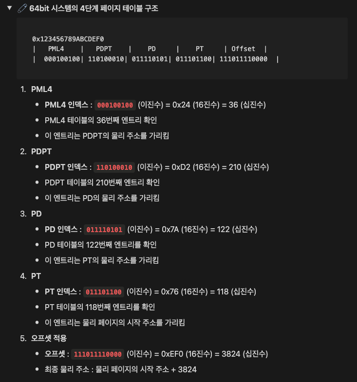

# User Program

## 개요

### **운영 체제의 제어 회수 방법**

첫 번째 프로젝트에서는 타이머 및 I/O 장치로부터의 인터럽트, 즉 "외부" 인터럽트를 통해 운영 체제가 사용자 프로그램으로부터 제어를 회수하는 방법을 다룬다. 외부 인터럽트는 CPU 외부의 엔티티에 의해 발생한다.

운영 체제는 프로그램 코드에서 발생하는 소프트웨어 예외도 처리한다. 이러한 예외는 페이지 폴트나 0으로 나누기 같은 오류일 수 있다. 예외는 사용자 프로그램이 운영 체제의 서비스를 요청하는 수단("시스템 호출")이기도 하다.

전통적인 x86 아키텍처에서는 시스템 호출이 다른 소프트웨어 예외와 동일하게 처리된다. 그러나 x86-64에서는 제조업체가 시스템 호출을 위한 특별한 명령어 **`syscall`**을 도입했다. 이 명령어는 시스템 호출 핸들러를 빠르게 호출할 수 있게 한다.

현재 **`syscall`** 명령어는 x86-64에서 시스템 호출을 호출하는 가장 일반적인 수단이다. Pintos에서는 사용자 프로그램이 시스템 호출을 하기 위해 **`syscall`**을 사용한다. 시스템 호출 번호와 추가 인자는 일반적인 방식으로 레지스터에 설정되지만 두 가지 예외가 있다:

- **`%rax`는 시스템 호출 번호를 담는다.**
- **네 번째 인자는 `%rcx`가 아닌 `%r10`을 사용한다.**

따라서 시스템 호출 핸들러 **`syscall_handler()`**가 제어를 얻으면, **시스템 호출 번호는 `%rax`에 있고, 인자는 다음 순서로 전달된다: `%rdi`, `%rsi`, `%rdx`, `%r10`, `%r8`, `%r9`.**

호출자의 레지스터는 **`struct intr_frame`**을 통해 접근할 수 있다 (**`struct intr_frame`**은 커널 스택에 있다).

x86-64의 함수 반환값 규약에 따르면, 반환값은 RAX 레지스터에 저장된다. 반환값을 갖는 시스템 호출은 **`struct intr_frame`**의 **`rax`** 멤버를 수정하여 반환값을 전달할 수 있다.

### **요약**

운영 체제는 타이머 및 I/O 장치로부터의 외부 인터럽트와 프로그램 코드 내에서 발생하는 소프트웨어 예외를 통해 사용자 프로그램으로부터 제어를 회수한다. x86-64 아키텍처에서는 **`syscall`** 명령어가 시스템 호출을 효율적으로 처리하며, 호출 번호는 **`%rax`**에, 인자는 **`%rdi`**, **`%rsi`**, **`%rdx`**, **`%r10`**, **`%r8`**, **`%r9`** 순서로 전달된다. 시스템 호출 핸들러는 **`struct intr_frame`**을 통해 호출자의 레지스터에 접근할 수 있으며, 반환값은 **`rax`** 레지스터를 통해 반환된다.

## Virtual Address

x86-64 아키텍처는 물리 주소를 직접 접근할 수 있는 방법을 제공하지 않는다. 운영 체제 커널에서는 이러한 능력이 종종 필요하므로, **Pintos는 이를 해결하기 위해 커널 가상 메모리를 물리 메모리에 일대일로 매핑하는 방식을 사용**한다. 즉, 가상 주소가 KERN_BASE보다 크면 물리 주소 0에 접근하고, 가상 주소 KERN_BASE + 0x1234는 물리 주소 0x1234에 접근하며, 이는 머신의 물리 메모리 크기까지 계속된다. 

 따라서 물리 주소에 KERN_BASE를 더하면 해당 주소에 접근할 수 있는 커널 가상 주소가 되고, 반대로 커널 가상 주소에서 KERN_BASE를 빼면 해당 물리 주소가 된다.

**A 64-bit virtual addresses** are structured as follows:

```c
63          48 47            39 38            30 29            21 20         12 11         0
+-------------+----------------+----------------+----------------+-------------+------------+
| Sign Extend |    Page-Map    | Page-Directory | Page-directory |  Page-Table |  Physical  |
|             | Level-4 Offset |    Pointer     |     Offset     |   Offset    |   Offset   |
+-------------+----------------+----------------+----------------+-------------+------------+
              |                |                |                |             |            |
              +------- 9 ------+------- 9 ------+------- 9 ------+----- 9 -----+---- 12 ----+
                                          Virtual Address
```

Header `include/threads/vaddr.h` and `include/threads/mmu.h` define these functions and macros for working with virtual addresses:

### pintOS `/include/vaddr.h` 매크로 분석

```c
/* Page offset (bits 0:12). */
#define PGSHIFT 0                          /* Index of first offset bit. */
#define PGBITS  12                         /* Number of offset bits. */
#define PGSIZE  (1 << PGBITS)              /* Bytes in a page. */

#define PGMASK  BITMASK(PGSHIFT, PGBITS)   /* Page offset bits (0:12). */
```

> **페이지 관련 매크로**
> 

```c
/* Offset within a page. */
#define pg_ofs(va) ((uint64_t) (va) & PGMASK)

#define pg_no(va) ((uint64_t) (va) >> PGBITS)

/* Round up to nearest page boundary. */
#define pg_round_up(va) ((void *) (((uint64_t) (va) + PGSIZE - 1) & ~PGMASK))

/* Round down to nearest page boundary. */
#define pg_round_down(va) (void *) ((uint64_t) (va) & ~PGMASK)
```

> **커널 및 기타 매크로**
> 

```c
/* Kernel virtual address start */
#define KERN_BASE LOADER_KERN_BASE

/* User stack start */
#define USER_STACK 0x47480000

/* Returns true if VADDR is a user virtual address. */
#define is_user_vaddr(vaddr) (!is_kernel_vaddr((vaddr)))

/* Returns true if VADDR is a kernel virtual address. */
#define is_kernel_vaddr(vaddr) ((uint64_t)(vaddr) >= KERN_BASE)

// FIXME: add checking
/* Returns kernel virtual address at which physical address PADDR
 *  is mapped. */
#define ptov(paddr) ((void *) (((uint64_t) paddr) + KERN_BASE))

/* Returns physical address at which kernel virtual address VADDR
 * is mapped. */
#define vtop(vaddr) \
({ \
	ASSERT(is_kernel_vaddr(vaddr)); \
	((uint64_t) (vaddr) - (uint64_t) KERN_BASE);\
})
```

### **PML4 (Page Map Level 4)**

<aside>
💡 x86-64 아키텍처에서 사용하는 페이지 테이블 구조는 4단계로 이루어져 있으며, 각 단계는 메모리 주소 변환에 중요한 역할을 한다.

</aside>

> **PML4 (Page Map Level 4)**
> 

PML4는 최상위 레벨 페이지 테이블이다. PML4는 물리 메모리에 있는 PML4 테이블을 가리키는 512개의 엔트리를 포함한다. 각 엔트리는 다음 레벨 **페이지 디렉토리 포인터 테이블(PDPT)**를 가리킨다. 

> **PDPT (Page Directory Pointer Table)**
> 

PDPT는 PML4 아래의 두 번째 레벨 페이지 테이블이다. PDPT는 512개의 엔트리를 포함하며, 각 엔트리는 다음 레벨 **페이지 디렉토리 (PD)**를 가리킨다. PDPT는 종종 PDP (Page Directory Pointer)라고도 불린다.

> **PD (Page Directory)**
> 

PD는 세 번째 레벨 페이지 테이블이다. PD는 512개의 엔트리를 포함하며, 각 엔트리는 다음 레벨 페이지 테이블 (PT)을 가리킨다.

> **PT (Page Table)**
> 

PT는 네 번째 레벨 페이지 테이블이다. PT는 512개의 엔트리를 포함하며, 각 엔트리는 실제 물리 메모리의 페이지를 가리킨다.

### 각 단계의 엔트리 (PML4E, PDPTE, PDE, PTE)

<aside>
💡 **PML4E → PDPTE → PDE → PTE**
</aside>

<br>
사진 출처: youjuice - 박유주님
