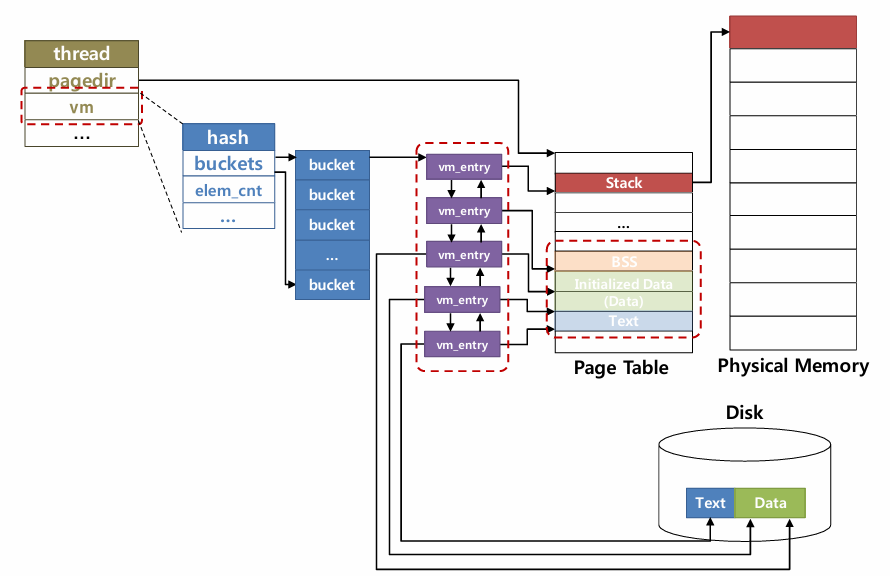

# Virtual Memory

## Memory Management



### Supplemental Page Table 구현

강의, PPT 내용의 `VM_Entry` → `Supplement Page Table` 로 변경된듯함.

`vm/vm.c` 에 있는 SPT 관리 함수들을 우선 구현한다.


- SPT에 추가 필요 정보들
    
    ```c
    - 무엇을 구현해야 하는가 ?
    
    1) Page Table
    
       - pintOS에서 Page Table은 x86 CPU에 의해 제공됨
       - Virtual Page Number <-> Physical Frame Number 매핑함
       - 개별 가상 페이지에 대한 추가 정보가 필요함
    	   주어진 가상 페이지의 디스크 위치 정보
    	   주어진 가상 페이지가 anonymous인지 / file-backed 인지 여부 등등
    	 - 추가 정보를 포함하는 개별 가상 페이지 자료구조를 정의해야함
    	 
    2) 추가적으로 필요한 정보
    
    	 - 가상 페이지 번호
    	 - 읽기/쓰기 권한
    	 - 가상 페이지 유형 (실행파일, 일반파일, swap area (==Anonymous page) 여부)
    		 실행 파일 페이지 : 수정하지 못하게 해야함
    		 일반 파일 페이지 : 어떤 파일에서 가져온 것인지에 대한 정보가 있어야 함
    ```
    
- Virtual Memory Page 자료구조
    
    ```c
    - vm_entry : Virtual Memory page 자료구조
    
    1. User program이 가상 메모리 주소 공간에 접근
    2. Page Table을 확인 -> 해당 page가 메모리에 없음
    3. Page fault 발생
    4. free frame을 할당
    5. 적절한 disk block을 할당 
    6. page를 메모리에 로드
    7. VM entry 데이터 구조를 할당하고 초기화한다
    ```

> ***SPT → Hash Map 으로 구현***
> 
- 코드 구현
    - ***struct page***
        
        ```c
        struct page {
        	const struct page_operations *operations;
        	void *va;              /* Address in terms of user space */
        	struct frame *frame;   /* Back reference for frame */
        
        	/* Your implementation */
        	struct hash_elem h_elem;
        	bool writable;
        
        	/* Per-type data are binded into the union.
        	 * Each function automatically detects the current union */
        	union {
        		struct uninit_page uninit;
        		struct anon_page anon;
        		struct file_page file;
        #ifdef EFILESYS
        		struct page_cache page_cache;
        #endif
        	};
        };
        ```
        
    - ***struct frame***
        
        ```c
        struct frame {
        	void *kva;
        	struct page *page;
        	struct list_elem f_elem;
        };
        ```
        

- [x]  `supplemental_page_table_init`
- [x]  `spt_find_page`
- [x]  `spt_insert_page`

- ***코드 구현***
    
    > `supplemental_page_table_init`
    > 
    
    ```c
    void
    supplemental_page_table_init (struct supplemental_page_table *spt UNUSED) {
    	hash_init(&spt->hash_brown, hash_hash_func_impl, hash_less_func_impl, NULL);
    }
    ```
    
    > `spt_find_page`
    > 
    
    ```c
    struct page *
    spt_find_page (struct supplemental_page_table *spt UNUSED, void *va UNUSED) {
    	struct page *page = (struct page*)malloc(sizeof(struct page));
    	page->va = pg_round_down(va);	// va가 가리키는 가상 페이지의 시작 포인트 (오프셋이 0으로 설정된 va) 반환
    
    	struct hash_elem *e = hash_find(&spt->hash_brown, &page->h_elem);
    
    	free(page);
    
    	return e != NULL ? hash_entry(e, struct page, h_elem) : NULL;
    }
    ```
    
    > `spt_insert_page`
    > 
    
    ```c
    bool
    spt_insert_page (struct supplemental_page_table *spt UNUSED,
    		struct page *page UNUSED) {
    	int succ = false;
    	if (hash_insert(&spt->hash_brown, &page->h_elem) == NULL)
    		succ = true;
    	return succ;
    }
    ```
    

## Frame Management 구현

vm 관련 함수들 구현한다.

- [x]  `vm_get_frame`
- [x]  `vm_do_claim_page`
- [x]  `vm_claim_page`

- ***코드 구현***
    
    > `vm_get_frame`
    > 
    
    ```c
    static struct frame *
    vm_get_frame (void) {
    	struct frame *frame = (struct frame*)malloc(sizeof(struct frame));
        frame->kva = palloc_get_page(PAL_USER);
    
        if (frame->kva == NULL) {
    		PANIC("TODO. ");
            
        }
    	// lock_acquire(&frame_lock);
        list_push_back (&frame_table, &frame->f_elem);
    	// lock_release(&frame_lock);
        frame->page = NULL;
    
    	ASSERT (frame != NULL);
    	ASSERT (frame->page == NULL);
    	return frame;
    }
    ```
    
    > `vm_do_claim_page`
    > 
    
    ```c
    static bool
    vm_do_claim_page (struct page *page) {
    	struct frame *frame = vm_get_frame ();
    
    	/* Set links */
    	frame->page = page;
    	page->frame = frame;
    
    	/* TODO: Insert page table entry to map page's VA to frame's PA. */
    	struct thread *curr = thread_current();
        bool success = pml4_set_page (curr->pml4, page->va, frame->kva, page->writable);
    
        return success ? swap_in(page, frame->kva) : false;
    }
    ```
    
    > `vm_claim_page`
    > 
    
    ```c
    bool
    vm_claim_page (void *va UNUSED) {
    	struct page *page = spt_find_page(&thread_current()->spt, va);
    	if (page == NULL) 
    		return false;
    	return vm_do_claim_page (page);
    }
    ```


## Anonymous page

### Page Initialization with Lazy loading

lazy loading을 사용한 페이지 초기화 구현 - 페이지 타입별로 초기화 해주어야 함.

- 자료 구조 선언체
    
    > ***Struct File Page***
    > 
    
    ```c
    struct file_page {
    	struct file* file;
    	size_t offset;
    	size_t read_bytes;
    	size_t zero_bytes;
    };
    ```
    
    > ***프레임 테이블***
    > 
    
    ```c
    struct list frame_list;
    struct lock frame_lock;
    ```
    
    > ***lazy load용 임시 struct 객체***
    > 
    
    ```c
    struct lazy_load_info
    {
    	struct file *file;
    	size_t ofs;
    	size_t read_bytes;
    	size_t zero_bytes;
    };
    ```
    

<aside>
💡 새로운 페이지 할당 요청 → `vm_alloc_page_with_initializer` 호출 → 페이지 구조체 할당, 페이지 타입에 따른 초기화 함수로 초기화 → 유저 프로그램에 제어권 이전.

</aside>

- [x]  `anon_initializer`
- [x]  `file_backed_initializer`

### Lazy Loading for Executable

`include/vm/uinit.c` 에서 초기화되지 않은 페이지의 생성, 초기화, 삭제하는 함수를 구현할 것. (후 순위).

### Page Fault Handler 구현

<aside>
💡 페이지 폴트 → 페이지 폴트 핸들러는 `vm_try_handle_fault` 함수에게 제어권을 넘긴다.

</aside>

- 유효한 페이지 폴트인지 검사
    - Valid    : 유효하지 않은 페이지에 접근 → 프로그램 종료
    - Invalid : bogus → 페이지에서 콘텐츠를 로드하고 유저 프로그램에게 제어권을 반환

- bogus 페이지 폴트의 케이스
    - 지연 로딩 페이지
    - 스왑 아웃 페이지
    - 쓰기 보호 페이지

먼저 지연 로드 페이지 먼저 생각해서 구현해볼 것.

### `vm_alloc_page_with_initializer()` 구현

인자로 전달할 `vm_type` 에 맞는 적절한 초기화 함수를 가져와야 하고 이 함수를 인자로 갖는 `uinit_new` 함수를 호출해야 함.

- [x]  `vm_alloc_page_with_initializer`
- [x]  `uninit_initialize`
- [x]  `vm_anon_init`
- [x]  `anon_initializer`

- ***코드 구현***
    
    > `vm_alloc_page_with_initializer`
    > 
    
    ```c
    bool
    vm_alloc_page_with_initializer (enum vm_type type, void *upage, bool writable,
    		vm_initializer *init, void *aux) {
    
    	ASSERT (VM_TYPE(type) != VM_UNINIT)
    
    	struct supplemental_page_table *spt = &thread_current ()->spt;
    
    	/* Check wheter the upage is already occupied or not. */
    	if (spt_find_page (spt, upage) == NULL) {
    		struct page *newpage = malloc(sizeof(struct page));
    		switch (VM_TYPE(type))
    		{
    		case VM_ANON:
    			uninit_new(newpage, pg_round_down(upage), init, type, aux, anon_initializer);
    			break;
    
    		case VM_FILE:
    			uninit_new(newpage, pg_round_down(upage), init, type, aux, file_backed_initializer);
    			break;
    
    		default:
    			break;
    		}
    		/* after uninit_new, you have to fix fields. */
    		newpage->writable = writable;
    		
    		/* TODO: Insert the page into the spt. */
    		if (spt_insert_page(spt, newpage)) 
    			return true;
    		else 
    			goto err;
    	}
    err:
    	return false;
    }
    ```
    
    > `uninit_initialize`
    > 
    

### `load_segment` , `lazy_load_segment` 구현

실행 파일로부터 세그먼트가 로드되는 것을 구현. 모든 페이지들은 전역적으로 로드될 것이다. → 이 페이지들에서 발생한 page fault를 커널에서 다루게 된다.

- [x]  `load_segment`
- [x]  `lazy_load_segment`
- [x]  `setup_stack` 수정
- [x]  `spt_find_page` → `vm_try_handle_fault` 수정

## 분석 내용

### Supplemental Page Table

```c
1) Page Table

- pintOS에서 Page Table은 x86 CPU에 의해 제공됨
- Virtual Page Number <-> Physical Frame Number 매핑함
- 개별 가상 페이지에 대한 추가 정보가 필요함
 주어진 가상 페이지의 디스크 위치 정보
 주어진 가상 페이지가 anonymous인지 / file-backed 인지 여부 등등
- 추가 정보를 포함하는 개별 가상 페이지 자료구조를 정의해야함
```

```c
2) 추가적으로 필요한 정보

- 가상 페이지 번호
- 읽기/쓰기 권한
- 가상 페이지 유형 (실행파일, 일반파일, swap area (==Anonymous page) 여부)
 실행 파일 페이지 : 수정하지 못하게 해야함
 일반 파일 페이지 : 어떤 파일에서 가져온 것인지에 대한 정보가 있어야 함
 
```

### Page Table Code

```c
struct page {
	const struct page_operations *operations;
	void *va;              /* Address in terms of user space */
	struct frame *frame;   /* Back reference for frame */

	/* Your implementation */

	/* Per-type data are binded into the union.
	 * Each function automatically detects the current union */
	union {
		struct uninit_page uninit;
		struct anon_page anon;
		struct file_page file;
#ifdef EFILESYS
		struct page_cache page_cache;
#endif
	};
};
```

## Stack Growth

### 구현 목록

- [x]  `syscall_handler()`
- [x]  `vm_try_handle_fault()`
- [x]  `vm_stack_growth()`

요청된 페이지 폴트 처리가 들어올 때마다 스택 성장을 시킨다.

- ***코드 구현***
    
    > `vm_try_handle_fault`
    > 
    
    ```c
    bool
    vm_try_handle_fault (struct intr_frame *f UNUSED, void *addr UNUSED,
    		bool user UNUSED, bool write UNUSED, bool not_present UNUSED) {
    	/* TODO: Validate the fault */
    	if (addr == NULL || is_kernel_vaddr(addr)) 
    		return false;
    	
    	if (!not_present && write)
    		return false;
    
    	struct supplemental_page_table *spt UNUSED = &thread_current ()->spt;
    	struct page *page = spt_find_page(spt, pg_round_down(addr));
    	uint64_t rsp = user ? f->rsp : thread_current()->rsp;
    
    #ifdef DEBUG
    printf("PF status / addr: %ld, rsp: %ld frsp: %ld, user: %d, write: %d, not_present: %d \n"
    		, (addr), rsp, f->rsp, user, write, not_present);
    #endif
    
    	if (page == NULL) {
    		if (pg_round_down(addr) >= MAX_STACK_BOTTOM && addr < USER_STACK && addr >= rsp - 8) {
    			vm_stack_growth((pg_round_down(addr)));
    			return true;
    		}
    		else
    			return false;
    	}
    
    done:
    	return vm_do_claim_page(page);
    }
    ```
    
    > `vm_stack_growth`
    > 
    
    ```c
    static void
    vm_stack_growth (void *addr UNUSED) {
    	if (!vm_alloc_page(VM_ANON, addr, true) && !vm_claim_page(addr)) {
    		vm_dealloc_page(spt_find_page(&thread_current()->spt, addr));
    	}
    }
    ```


## Memory Mapped Files

<aside>
💡 메모리 매핑된 페이지 구현하기. <br>
- 익명 페이지와 달리 메모리 매핑된 페이지는 파일 기반 매핑이다. 페이지의 콘텐츠는 일부 기존 파일의 데이터를 미러링한다. <br>
- 페이지 폴트가 발생하면 물리적 프레임이 즉시 할당되고, 내용이 파일에서 메모리로 복사된다. <br>
- 메모리 매핑된 페이지가 unmapped 또는 swapped out 되면, 콘텐츠의 모든 변경 사항이 파일에 반영된다. <br>
</aside>

## `mmap` and `munmap` System Call 구현

- [x]  `mmap`
- [x]  `munmap`

> VM 시스템은 mmap 영역에서 페이지를 lazy load 한 후, mmap 된 파일 자체를 매핑을 위한 백업 저장소로 사용해야 한다.
> 

### 수정

- [x]  `do_mmap`
- [x]  `do_munmap`

- `mmap`
    
    fd로 열린 파일의 오프셋 바이트로부터 length 바이트 만큼을 프로세스의 가상 주소 공간의 주소 addr에 매핑한다.
    
    전체 파일은 addr 에서 시작하는 연속 가상 페이지에 매핑된다. 파일 길이가 PGSIZE의 배수가 아닌 경우 최종 매핑된 페이지의 일부 바이트가 파일 끝을 넘어 `stick out` 된다. 
    `page_fault` 가 발생하면 이 바이트를 0으로 설정하고 페이지를 디스크에 다시 쓸 때 버린다.
    성공하면 이 함수는 파일이 매핑된 가상 주소를 반환하고, 실패하면 파일을 매핑하는데 유효한 주소가 아닌 NULL을 반환해야 한다.
    
    > `stick out`
    쓰는 주소값의 오프셋이 0이라고 가정하고 쓸 파일의 길이가 4100이라면
    페이지는 2개를 할당 받을텐데, 2번째 페이지는 4092 만큼 비어 있을 것이다.
    나중에 swap-out 시 2번째 페이지의 4092의 데이터는 파일에 쓰지 않고 버려야 한다.
    > 
    
    fd로 열린 파일의 길이가 0바이트인 경우 `mmap`에 대한 호출이 실패할 수 있다. addr이 page-aligned 되지 않았거나, 기존 매핑된 페이지 집합 (실행 가능 파일이 동작하는 동안 매핑된 스택 혹은 페이지를 포함)과 겹치는 경우 실패해야 한다.
    
    Linux에서 `addr` 이 NULL이면 커널은 매핑을 생성할 적절한 주소를 찾는다. 단순화를 위해 주어진 `addr` 에서 mmap을 시도할 수 있다.
    
    → 따라서 `addr` 이 0이면 pintos코드는 가상 페이지 0이 매핑되지 않는다고 가정하기 때문에 실패해야 한다. `length` 가 0일 때도 mmap은 실패해야 한다. 
    
    메모리 매핑된 페이지도 익명 페이지처럼 lazy load로 할당되어야 한다. `vm_alloc_page_with_initializer` 혹은 `vm_alloc_page` 를 사용하여 페이지 개체를 만든다.
    
- `munmap`
    
    지정된 주소 범위 addr에 대한 매핑을 해제한다.
    
    지정된 주소는 아직 매핑 해제되지 않은 동일한 프로세서의 mmap에 대한 이전 호출에서 반환된 가상 주소여야 한다. 
    
    종료를 통하거나 다른 방법을 통해 프로세스가 `exit` 되면 모든 매핑이 암시적으로 매핑 해제된다. 암시적이든 명시적이든 매핑이 해제되면 프로세스에서 쓴 모든 페이지는 파일에 다시 기록되며 기록되지 않은 페이지는 기록되지 않아야 한다. 그 후 해당 페이지는 프로세스의 가상 페이지 목록에서 제거된다. 
    
    파일을 닫거나 제거해도 해당 매핑이 매핑 해제되지 않는다. 생성된 매핑은 Unix 규칙에 따라 `munmap` 이 호출되거나 프로세스가 종료될 때까지 유효하다. 각 매핑에 대해 파일에 대한 개별적이고 독립적인 참조를 얻으려면 `file_reopen` 함수를 사용해야 한다.
    
    둘 이상의 프로세스가 동일한 파일을 매핑하는 경우 일관된 데이터를 볼 필요가 없다. Unix는 두 매핑이 동일한 물리적 페이지를 공유하도록 한다. 그리고 mmap system call에는 클라이언트가 페이지를 share, private(cow) 여부를 결정할 수 있도록 하는 인수도 있다.

## Swap In/Out

> 현재 사용되지 않고 있는 메모리 프레임들을 디스크로 스왑 아웃 하는 것이다. 일부는 일부 메모리 자원들을 해제 시켜서 다른 앱들이 이 자원들을 사용할 수 있게 해준다.
> 

### 스와핑 과정

메모리 고갈 상태에서 메모리 할당 요청 → OS 감지 → Swap 디스크로 evict 시킬 페이지를 선택 → 메모리 프레임의 상태를 동일하게 디스크에 복사 *(=스왑 아웃)* → 프로세스가 스왑 아웃된 페이지에 접근 시도 → OS는 디스크에 복사해둔 내용을 다시 메모리에 가져옴.

퇴거의 대상이 되는 페이지는 익명 페이지 또는 파일 기반 페이지 일 수 있다.

모든 스와핑 연산은 명시적으로 호출되는 것이 아니라 ***함수 포인터로 호출된다.*** 이 연산들은 `struct page_operations file_ops` 의 멤버 변수로써 각 페이지의 initializer에 대한 operation으로 등록되어 있다.

## Anonymous Page

### Modify `vm_anon_init` and `anon_initailizer` in `vm/anon.c`

> 익명 페이지에는 백업 저장소가 없다. 익명 페이지의 스와핑을 지원하기 위해 스왑 디스크라는 임시 백업 저장소를 제공한다. 스왑 디스크를 활용, 익명 페이지에 대한 스왑을 구현한다.
> 

- [x]  `vm_anon_init`
    - details
        
        스왑 디스크를 설정해야 한다. 또한 스왑 디스크에서 사용 가능한 영역과 사용된 영역을 관리하기 위한 데이터 구조가 필요하다. 스왑 영역도 PGSIZE(4096바이트) 단위로 관리된다.
        
- [x]  `anon_initializer`
    - details
        
        스와핑을 지원하기 위해서 anon_page에 정보를 추가해야 한다.
        
- [x]  `anon_swap_out`
    - details
        
        스왑 아웃을 먼저 구현할 것!
        
        익명 페이지 (교체) 스왑 디스크 :: 1) 스왑 테이블을 사용, 사용 가능한 스왑 슬롯을 찾음 → 2) 데이터 페이지를 슬롯에 복사. → 3) 슬롯 없으면 커널 패닉
        
        > 메모리에서 디스크로 내용을 복사하여 익명 페이지를 스왑 디스크로 교체한다. 먼저 스왑 테이블을 사용하여 디스크에서 사용 가능한 스왑 슬롯을 찾은 다음 데이터 페이지를 슬롯에 복사한다. 디스크에 사용 가능한 슬롯이 더 이상 없으면 커널 패닉이 발생.
        > 
- [x]  `anon_swap_in`
    - details
        
        스왑 디스크 데이터 내용을 읽어서 익명 페이지를 (디스크에서 메모리로) swap in.
        
        스왑 아웃 될 때, 페이지 구조체는 스왑 디스크에 저장되어 있어야 한다. 스왑 테이블을 업데이트 해야 한다. (스왑 테이블 관리 참조)
        

## File-Mapped Page

> 즉, file-backed 페이지를 evict 하면 해당 페이지가 매핑된 파일에 다시 기록.
> 

- [x]  `file_backed_swap_in`
    - details
        
        파일에서 컨텐츠를 읽어 kva 페이지에서 swap in 한다. 파일 시스템과 동기화 해야 함.
        
- [x]  `file_backed_swap_out`
    - details
        
        `dirty` bit로 확인하여 내용을 다시 파일에 기록하며 swap out.
        
        `dirty` bit off
